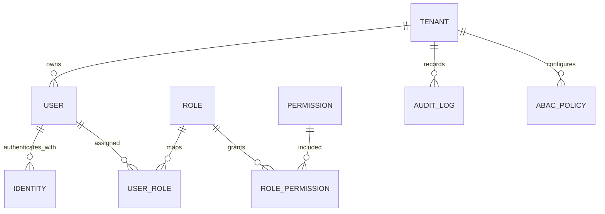
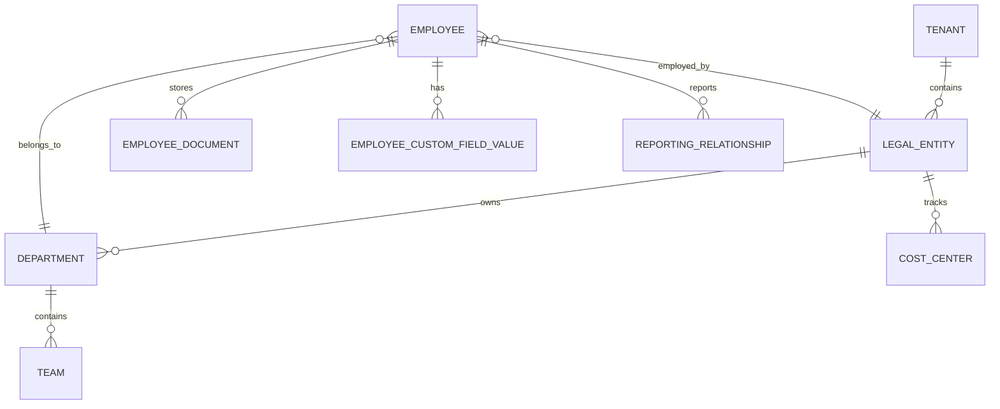
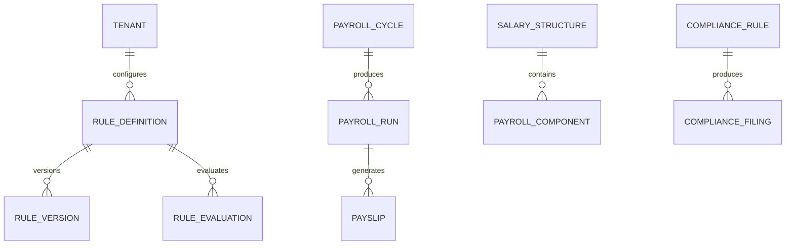

# ER Diagrams

## Tenant, Identity, and Security

```mermaid
erDiagram
  TENANT ||--o{ USER : owns
  USER ||--o{ IDENTITY : authenticates_with
  USER ||--o{ USER_ROLE : assigned
  ROLE ||--o{ USER_ROLE : maps
  ROLE ||--o{ ROLE_PERMISSION : grants
  PERMISSION ||--o{ ROLE_PERMISSION : included
  TENANT ||--o{ AUDIT_LOG : records
  TENANT ||--o{ ABAC_POLICY : configures
```

## Organization and Employee

```mermaid
erDiagram
  TENANT ||--o{ LEGAL_ENTITY : contains
  LEGAL_ENTITY ||--o{ DEPARTMENT : owns
  DEPARTMENT ||--o{ TEAM : contains
  LEGAL_ENTITY ||--o{ COST_CENTER : tracks
  EMPLOYEE }o--|| LEGAL_ENTITY : employed_by
  EMPLOYEE }o--|| DEPARTMENT : belongs_to
  EMPLOYEE ||--o{ EMPLOYEE_DOCUMENT : stores
  EMPLOYEE ||--o{ EMPLOYEE_CUSTOM_FIELD_VALUE : has
  EMPLOYEE ||--o{ REPORTING_RELATIONSHIP : reports
```

## Rules, Payroll, and Compliance

```mermaid
erDiagram
  TENANT ||--o{ RULE_DEFINITION : configures
  RULE_DEFINITION ||--o{ RULE_VERSION : versions
  RULE_DEFINITION ||--o{ RULE_EVALUATION : evaluates
  PAYROLL_CYCLE ||--o{ PAYROLL_RUN : produces
  PAYROLL_RUN ||--o{ PAYSLIP : generates
  SALARY_STRUCTURE ||--o{ PAYROLL_COMPONENT : contains
  COMPLIANCE_RULE ||--o{ COMPLIANCE_FILING : produces
```

